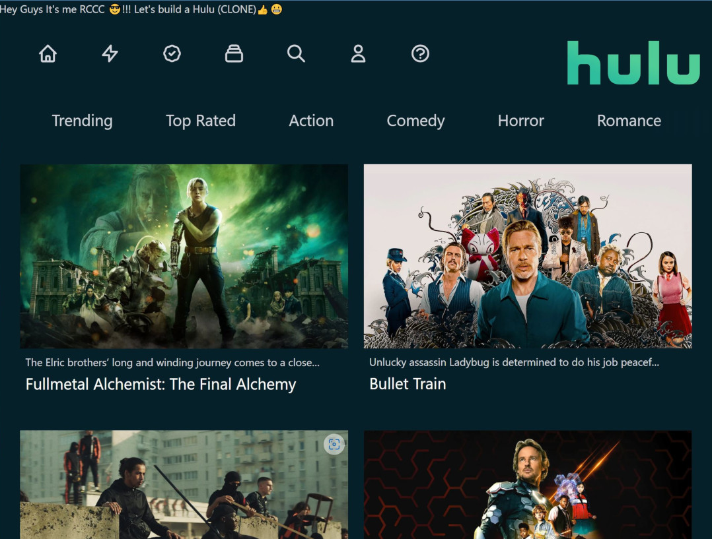

# Hulu-react

Hulu-like app that simulates Hulu UI. Movie posters, thumbnails and descriptions are obtained from TMDB through its [API](https://www.themoviedb.org/documentation/api) and react-axios component. The movies are classified into different categories displayed at the Navbar and go from Trending, top-rated, and TV Series among others. It's responsive design and mobile first.

See it in action at: https://hulu-react.vercel.app/

## Screenshots:
<div align="center">
  
</div>

## Technologies

The following technologies, dependencies and services were used to implement this app:
- ReactJs
- [Next.js](https://nextjs.org/).
- [TailwindCSS](https://tailwindcss.com/).
- [HeroIcons](https://heroicons.com/).
- [TMDB API](https://www.themoviedb.org/documentation/api)
- [Axios](https://github.com/axios/axios) for making http requests to the TMDB API.

## Disclaimer
This is just a demo for testing purposes only and to demonstrate react & Next.js capabilities.

## Setup Instructions

First, run the development server:

```bash
npm run dev
# or
yarn dev
```

Open [http://localhost:3000](http://localhost:3000) with your browser to see the result.

You can start editing the page by modifying `pages/index.js`. The page auto-updates as you edit the file.

[API routes](https://nextjs.org/docs/api-routes/introduction) can be accessed on [http://localhost:3000/api/hello](http://localhost:3000/api/hello). This endpoint can be edited in `pages/api/hello.js`.

The `pages/api` directory is mapped to `/api/*`. Files in this directory are treated as [API routes](https://nextjs.org/docs/api-routes/introduction) instead of React pages.

## Learn More

To learn more about Next.js, take a look at the following resources:

- [Next.js Documentation](https://nextjs.org/docs) - learn about Next.js features and API.
- [Learn Next.js](https://nextjs.org/learn) - an interactive Next.js tutorial.

You can check out [the Next.js GitHub repository](https://github.com/vercel/next.js/) - your feedback and contributions are welcome!

## Deploy on Vercel

The easiest way to deploy your Next.js app is to use the [Vercel Platform](https://vercel.com/new?utm_medium=default-template&filter=next.js&utm_source=create-next-app&utm_campaign=create-next-app-readme) from the creators of Next.js.

Check out our [Next.js deployment documentation](https://nextjs.org/docs/deployment) for more details.
